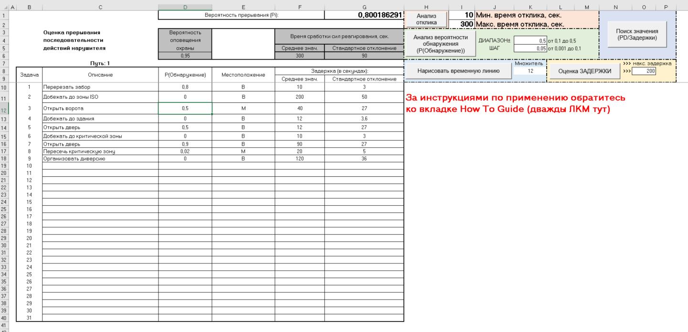

`# Локализация и доработка EASI (Excel/VBA)`


*Переведённый интерфейс листа "XL Easi"*


## Требования
  Windows (тестировано на Windows 10)
  Microsoft Excel 2007 или новее (тестировано на Office 2016)
  Git с Git Bash (для применения патчей)

## Описание

Исходный файл — `EASI-Simplified-Version-for-Final-Draft.xls` — является доработанной версией программы `EASI_2000.xls`, представляющей компьютерную реализацию модели **EASI** (Estimate of Adversary Sequence Interruption — Оценка вероятности прерывания последовательности действий нарушителя). Это простой и удобный в использовании метод оценки эффективности систем физической защиты (далее СФЗ) на заданном пути при определенных угрозах и состоянии самой системы. Эта модель рассчитывает вероятность прерывания действий нарушителя исходя из анализа взаимодействия обнаружения, задержки, реагирования и передачи информации. И не смотря на то что программа была найдена на сайте исправительных учреждений, она применима ко множеству других защищаемых объектов.

Программа `EASI_2000.xls` стала известна автору патча из книги:  **Гарсиа М. "Проектирование и оценка систем физической защиты"** (пер. с англ. В.И. Воропаева, Е.Е. Зудина).

Оригинальный файл был найден на сайте исправительных учреждений США, ныне архивной странице:  
[Correction.org](https://web.archive.org/web/20160216132531/http://correction.org/staffing-analysis-clearinghouse/)
(по данным архива, последний вариант опубликован в 2016 г., разработан, вероятно, в середине 2000-х).

Данный проект — **EASI_Advanced_version_RUS.xls** — возник в рамках подготовки **докторской диссертации моего преподавателя в ВУЗе по направлению "Информационная безопасность"**.  
Работа включала:
  - частичный перевод интерфейса и макросов на русский язык,
  - комментирование кода VBA,
  - восстановление и доработку функционала (в т.ч. механизм добавления/удаления зон на листе "MultiPath Input", построение временных линий),
  - улучшение визуальной части.

**Важно**:  
  - Авторские права на исходную программу, вероятно, принадлежат **Sandia National Laboratories** (первоначальный разработчик методики), однако точный статус неизвестен.  
  - Права на доработанную версию не принадлежат автору патчей — она создана в образовательных целях.

## Содержимое репозитория

Репозиторий содержит:
  - патч-файл `easi_vba_code.patch` — изменения VBA-кода,
  - макросы `ApplyAllChanges.bas`, `ApplyPart1.bas`, `ApplyPart2.bas` — для автоматического применения изменений оформления,
  - инструкцию `Инструкция EASI_RUS.pdf`.

**Исходный `.xls`-файл в репозиторий не включён** — его необходимо скачать самостоятельно (сохранился лишь в архивной версии сайта).

## Инструкция по применению патча

1. Скачайте оригинальный файл: [`EASI-Simplified-Version-for-Final-Draft.xls`](https://web.archive.org/web/20160821213421/http://correction.org/wp-content/uploads/2016/01/EASI-Simplified-Version-for-Final-Draft.xls). Сохраните его в ту же директорию, где находится этот репозиторий.

2. Откройте файл в Excel, разрешите использование макросов и перейдите в редактор VBA:  
  - Через вкладку **«Разработчик» → «Visual Basic»**,  
  - Или нажмите **Alt+F11** (вкладка «Разработчик» может быть не включена — это не обязательно).

3. Экспортируйте внутри директории локального репозитория в отдельную папку, например "original", следующие элементы (**File → Export File... CTRL+E** или ПКМ → Export):
  - `Sheet1` (MultiPath Input)
  - `Sheet2` (XL Easi)
  - `Sheet6` (Results)
  - `Sheet7` (LOOKUP)
  - `ThisWorkbook`
  - `Module1`

4. Откройте **Git Bash**, перейдите в папку с экспортированными файлами и примените патч:
    ```bash
    cd /путь/к/папке/
    patch -p1 --ignore-whitespace < ../easi_vba_code.patch

5. Вернитесь в редактор VBA и импортируйте пропатченные файлы (**File → Import File... (CTRL+M)**). Импортированные модули получат имена с суффиксом 1 (например, Sheet11, Module11).

6. Вручную замените код в оригинальных модулях на код из импортированных. Не копируйте первые 4 строки вида VERSION ... END — они не нужны при ручной замене кода.

7. Импортируйте файлы:
  ApplyAllChanges.bas
  ApplyPart1.bas
  ApplyPart2.bas

8. Запустите макрос ApplyAllChanges (через вкладку «Разработчик» → «Макросы» или из редактора VBA). Дождитесь сообщения «Готово!».
	⚠️ Во время работы макроса не взаимодействуйте с Excel — возможны ошибки. Это допустимо только при появлении предупреждений об объединённых ячейках — нажимайте OK.

9. Удалите временные импортированные модули (Sheet11, Sheet21, Sheet61, Sheet71, ThisWorkbook1, Module11, Module2, Module3, Module4), закройте редактор VBA и сохраните файл под новым именем ("Файл" → "Сохранить как" → "Обзор"), например: EASI_Advanced_version_RUS.xls.

	
Ограничения и примечания:
  - Методика расчёта основана на данных начала 2000-х и не учитывает современные технологии средств защиты и предотвращения угроз. Результаты носят ориентировочный характер.
  - Макросы требуют разрешения на запуск при открытии книги
  - При вводе недопустимых значений (текст, отрицательные числа, десятичные значения там, где не ожидаются) — в большинстве случаев будут отображены сообщения об ошибке.
  - Некоторые процедуры VBA разбиты на части из-за ограничений Excel: Procedure too large (>64 КБ) и Out of memory (при большом объёме данных)
  - Лист How To Guide содержит оригинальную англоязычную инструкцию. Переведённая версия доступна в прилагаемом PDF: "Инструкция EASI_RUS.pdf". Для более подробных инструкций обращайтесь к [`COMPLETE-Final-Draft-JVA-Handbook-and-Appendices-12-2008.pdf`](https://web.archive.org/web/20160821205925/http://correction.org/wp-content/uploads/2014/05/COMPLETE-Final-Draft-JVA-Handbook-and-Appendices-12-2008.pdf) (он же [`Jail-Vulnerability-Assessment-JVA-Final-Draft.pdf`](https://correction.org/wp-content/uploads/2014/10/Jail-Vulnerability-Assessment-JVA-Final-Draft.pdf)).
  - Патч для переноса форматирования и структуры сгенерирован при помощи макроса GenStructDiffMacroPatch.bas созданного с применением нейросети Qwen. Макрос-генератор вложен в репозиторий и требует запуска из сторонней книги для сравнения двух файлов: измененной версии и оригинала.
	
Лицензия
  Изменения, внесённые в рамках данного проекта (патчи, макросы, документация), распространяются под лицензией [MIT](LICENSE).
  Оригинальный код и модель EASI остаются собственностью их правообладателей. Распространение модифицированной версии программы без разрешения правообладателя оригинала запрещено.
  Данный патч содержит исключительно авторские изменения и предназначен для ознакомления.


Если вы являетесь правообладателем оригинального кода EASI и у вас есть возражения против размещения данного локализационного патча, пожалуйста, свяжитесь со мной через [Issues](../../issues) этого репозитория. Я готов оперативно рассмотреть ваше обращение и удалить репозиторий при необходимости.

If you are a rights holder of the original EASI code and have objections to the publication of this localization patch, please contact me via the [Issues](../../issues) section of this repository. I am willing to promptly address your concerns and remove the repository if necessary.
